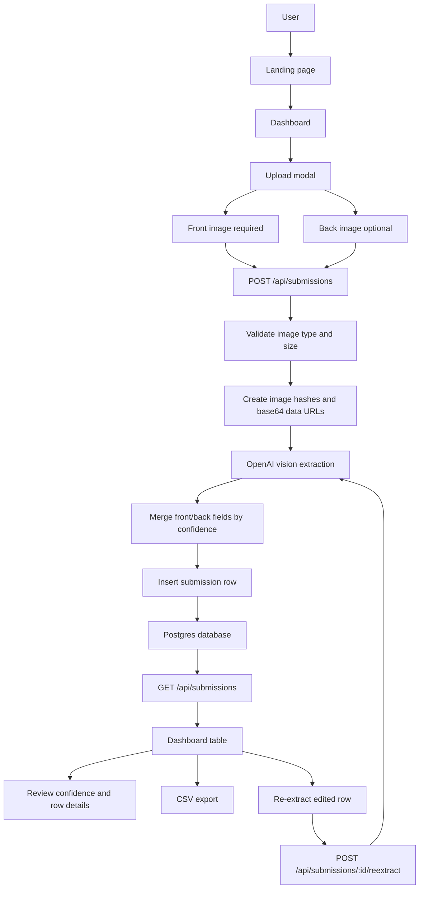
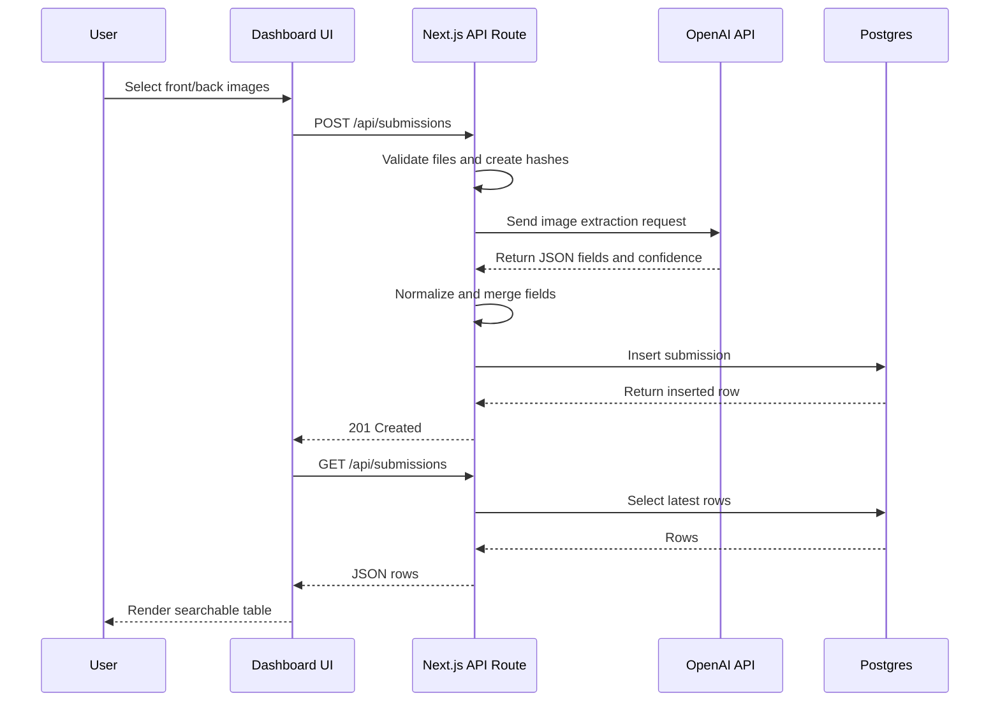
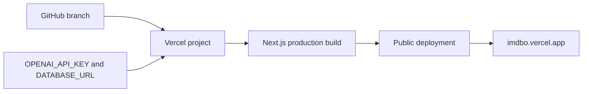

This page explains how the application works so another team can reproduce the build.

## System overview

Imdbo is a Next.js app that lets a user upload product package images, sends those images to an extraction API route, uses OpenAI vision extraction to read the package, stores the structured result in Postgres, and renders the saved rows in a dashboard table.



## Main parts

### Frontend

- `app/page.tsx` renders the landing page, demo video card, upload CTA, workflow summary, and FAQ.
- `app/dashboard/page.tsx` renders the dashboard page, opens the upload modal when `/dashboard?upload=1` is used, and shows the submissions table.
- `components/upload-form-content.tsx` handles front/back image selection, drag and drop, file validation, previews, and the submit action.
- `components/submissions-table.tsx` handles search, sorting, pagination, low-confidence filtering, row expansion, and CSV export.
- `components/submission-detail.tsx` shows the original images, extracted fields, raw extraction JSON, and inline editing controls.
- `components/dashboard-sidebar.tsx` provides dashboard navigation, CSV export trigger, clear-all action, and open/close sidebar behavior.

### API routes

- `POST /api/submissions` receives uploaded images, validates them, creates image hashes, calls OpenAI extraction, and stores a new submission.
- `GET /api/submissions` returns the latest submissions for the current client IP.
- `DELETE /api/submissions` clears all submissions for the current client IP.
- `GET /api/submissions/:id` fetches a single submission.
- `PATCH /api/submissions/:id` saves edited field values and edit history.
- `DELETE /api/submissions/:id` deletes one row.
- `POST /api/submissions/:id/reextract` re-runs extraction while preserving manually edited fields.

### Extraction logic

The extraction workflow lives in `lib/utils/extract-from-image.ts`.

1. Convert each uploaded image to base64.
2. Send the image to OpenAI with a prompt requesting exactly the 13 required catalog fields.
3. Parse the model response as JSON.
4. Normalize missing values to `null`.
5. Keep a `confidence` object keyed by field name.
6. If both front and back images exist, choose the value with the higher field confidence.
7. Retry sparse extractions so the app has another chance to fill more fields.

The required fields are:

- `itemName`
- `barcode`
- `manufacturer`
- `brand`
- `weight`
- `packagingType`
- `country`
- `variant`
- `type`
- `fragranceFlavor`
- `promotion`
- `addons`
- `tagline`

## Data model

The database schema is defined in `lib/db/schema.ts` and managed with Drizzle migrations in `migrations/`.

Each submission stores:

- Client IP owner: `userIp`
- The 13 extracted catalog fields
- Front and back image data URLs
- Front and back image hashes
- Per-field confidence scores
- Raw extraction JSON
- Manual edit flags
- Edit history
- Creation timestamp

## Request lifecycle



## Environment variables

The app needs these variables locally and in Vercel:

```bash
OPENAI_API_KEY=your_openai_api_key
DATABASE_URL=your_postgres_connection_string
```

Use these exact OpenAI pages when reproducing the setup:

- OpenAI Platform: [https://platform.openai.com](https://platform.openai.com)
- Billing: [https://platform.openai.com/settings/organization/billing/overview](https://platform.openai.com/settings/organization/billing/overview)
- API keys: [https://platform.openai.com/api-keys](https://platform.openai.com/api-keys)
- Usage: [https://platform.openai.com/usage](https://platform.openai.com/usage)
- Pricing: [https://platform.openai.com/docs/pricing](https://platform.openai.com/docs/pricing)

## Reproduction checklist

1. Clone the repository.
2. Install dependencies with `pnpm install`.
3. Create a Postgres database.
4. Add `OPENAI_API_KEY` and `DATABASE_URL` to `.env`.
5. Run `pnpm db:migrate`.
6. Run `pnpm dev`.
7. Open `/dashboard`.
8. Upload a front image and optional back image.
9. Confirm a row appears in the submissions table.
10. Test search, sort, row expansion, re-extract, clear, and CSV export.
11. Add the same environment variables to Vercel.
12. Deploy with `vercel deploy --prod`.

## Deployment flow


